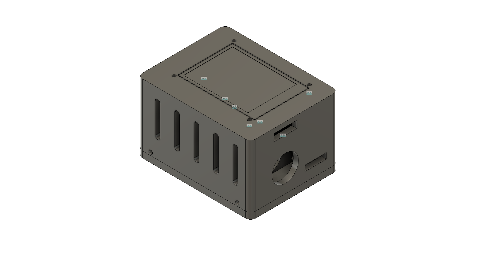
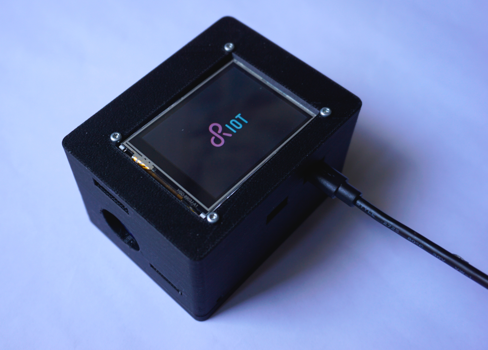

## RIOT-fp Demonstrator Case

This repository contains files for the RIOT-fp Demonstrator case.

## Casings

### Enviro Feather Box

#### Hardware

- [pms5003](https://aqicn.org/sensor/pms5003-7003/) particulate matter sensor
- [adafruit-feather-nrf52840-express](https://learn.adafruit.com/introducing-the-adafruit-nrf52840-feather) or [adafruit-feather-nrf52840-sense](https://www.adafruit.com/product/4516) (although other feather should work as well)
- [segger-jlink-mini](https://www.segger.com/products/debug-probes/j-link/models/j-link-edu-mini/) ( if a feather with jlink input is used)
- [enviro-plus-featherwing](https://shop.pimoroni.com/products/enviro-plus-featherwing): expensive way of getting a bme280 + pms5003 adapter.
